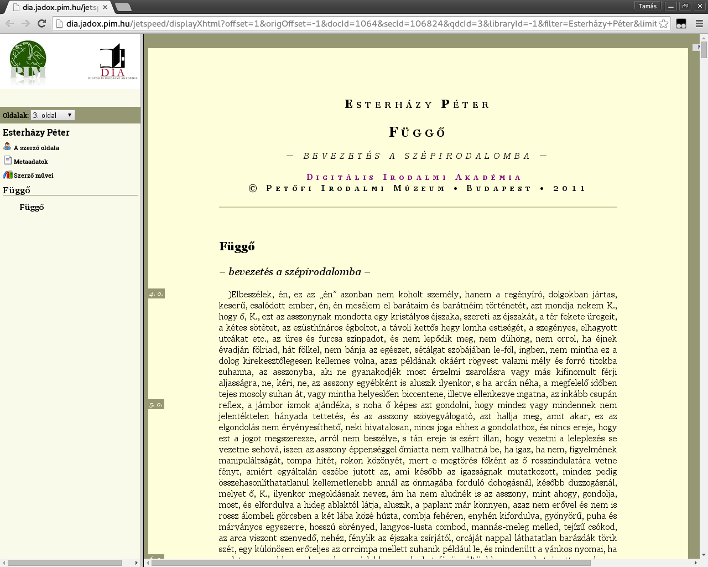
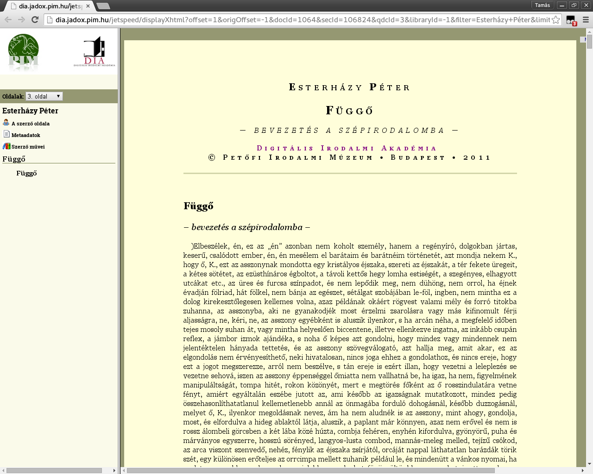

Clean DIA HTML
==============

Digitális Irodalmi Akadémia HTML tisztító (e-könyv készítéshez)

 

A szkript egyelőre egy dolgot csinál: leszedi az oldalszámokat.
Így az oldal a böngészőből elmentve használható e-könyv szerkesztéséhez,
pl. Calibrével EPUB-ot lehet belőle készíteni. Ha később találkozom olyan
művekkel, ahol más tisztítási művelet is szükséges, vagy kérés érkezik,
akkor bővíteni fogom a programot.

Telepítés
---------

A böngészőben telepítve kell, hogy legyen valamilyen Greasemonkey-kompatibilis
user script manager, pl. Firefoxhoz [Greasemonkey] (https://addons.mozilla.org/en-us/firefox/addon/greasemonkey/)
vagy Chrome-hoz / Safarihoz [Tampermonkey] (https://tampermonkey.net/).

Ha ez megvan, akkor a Greasy Forkról lehet telepíteni a szkriptet:

https://greasyfork.org/en/scripts/13315-clean-dia-html

Inaktiválás
-----------

Ha eredeti formában akarjuk olvasni a böngészőben a DIA-műveket, inaktiváljuk
a szkriptet.

Visszajelzés
------------

bitai.tamas kukac gmail.com
